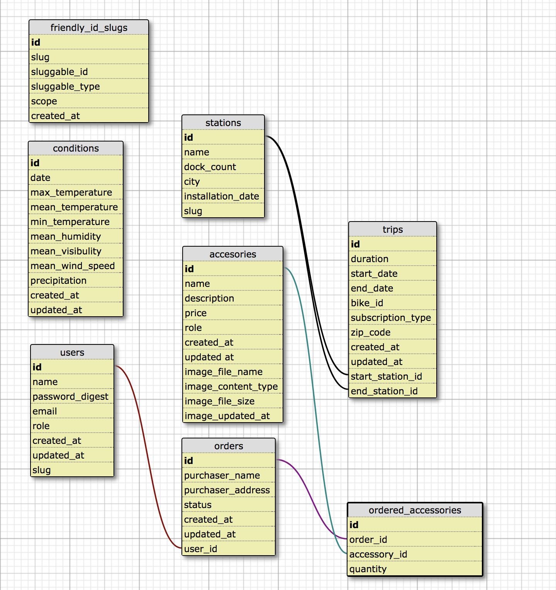

# Bike Share

Bike Share is a Ruby on Rails web server that utilizes ActiveRecord to parse through [SF Bay Area Bike Share data](https://www.kaggle.com/benhamner/sf-bay-area-bike-share/data). In this project, a station has many trips and trips have many weather conditions. Upon signing up, a user can view data analytics by clicking the dashboard links in the dropdown. Each station, trip, and condition page has a built in form where a user can create their own.

Additionally, we built an online commerce platform that allows for users to purchase items. A visitor can locate the store by clicking link the bike share header where they will see 12 with defaulted images.


## Table of Contents
- [Getting Started](#getting-started)
- [Prerequisites](#prequisites)
- [Installing](#installing)
- [Running the Tests](#running-the-tests)
- [Built With](#built-with)
- [Contributing](#contributing)

## Getting Started

These instructions will get you a copy of the project up and running on your local machine for development and testing purposes. See deployment for notes on how to deploy the project on a live system.

## Prerequisites

What things you need to install the software and how to install them

May want to include:

* Ruby version 2.5
* Rails version 5.1.5
* Postgress version 2.0
* Bcrypt verision 3.1.7
* Puma version 3.7
* SASS-Rails version 5.0

* System dependencies

```
bundle
```

## Installing

May want to include:
* To configure the database run the following commands.

```
rails db:create
rails db:migrate
rails db:seed
```
And if that fails:

```
rails db:reset
```

## Running the tests
In order to run the test suite, run the following command:
```
rspec
```

## Built With

* [paperclip](https://github.com/thoughtbot/paperclip)
* [bootstrap](https://github.com/twbs/bootstrap)
* [capybara](https://github.com/teamcapybara/capybara)
* [factorybot](https://github.com/thoughtbot/factory_bot)
* [database cleaner](https://github.com/DatabaseCleaner/database_cleaner)


## Contributing

Please feel free to submit pull requests and suggestions to this repository. We would love your feedback.
